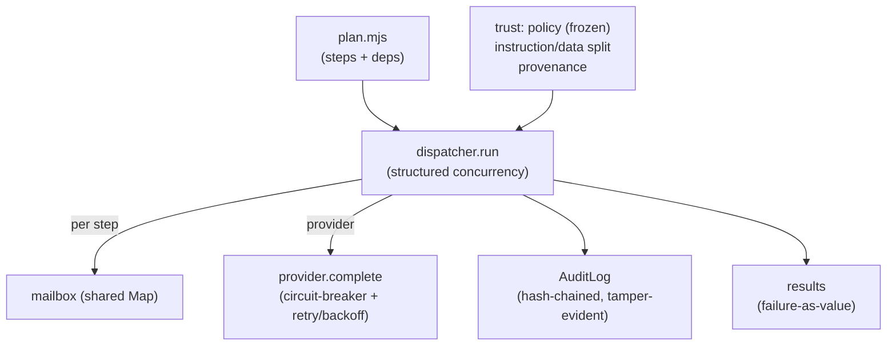

# keel — architecture

Zero external runtime dependencies; Node built-ins only. ESM throughout.

## Pipeline

## Modules
- `src/dispatcher.mjs` — `run(steps, ctx)`: topological schedule, parallel ready set, failure-as-value, failed-dependency skip, mailbox auto-populate, per-step audit, scoped credentials.
- `src/handlers.mjs` — declarative step kinds (`literal`, `llm`, `transform`, `shell`) + handler registry.
- `src/provider.mjs` — `mockProvider`, `fetchProvider` (real, OpenAI-compatible), `withCircuitBreaker` (CLOSED → OPEN → HALF_OPEN → CLOSED, exponential backoff).
- `src/sandbox.mjs` — `runShell` (subprocess isolation, timeout, scoped env, failure-as-value).
- `src/trust.mjs` — `createPolicy` (frozen), `separateInstructionData`, `provenance`, `AuditLog` (SHA-256 hash-chain, integrity-protected provenance).
- `src/cli.mjs` — `keel run --plan`.

## Layering (dependencies point down)
- **Trust** (`trust.mjs`): pure + `node:crypto` only — fully unit-tested.
- **Provider** (`provider.mjs`): the swappable boundary; circuit-breaker is self-contained plumbing.
- **Dispatcher** (`dispatcher.mjs`): composes a plan; depends on nothing but the step contracts.
- **CLI** (`cli.mjs`): thin orchestration over the three above.

## Test surface
- **Unit**: trust (freeze, instruction/data split, tamper-evidence), provider (breaker states, backoff), dispatcher (deps, parallelism, failure-as-value, failed-dep skip).
- **E2E probe**: a 3-step plan through dispatcher + provider + trust + audit; `audit.verify()` holds.
- Coverage (node built-in): 100% lines / ~93% branches on `src/`.
